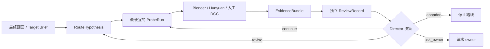

# Blender Harness v1

> **成熟度：实验性基础纵切。** 当前仓库已经实现可测试的路线、探针、证据与独立评审合同，真实 Blender GLB Quicklook，以及混元 Adapter 的能力面与可恢复作业骨架；它还不是生产资产审批、发布流水线或无人值守的 3D 工厂。

Blender 长程任务真正昂贵的失败，不是某一步报错，而是路线前提已经错了，团队仍继续做拓扑、绑定、服装和动画。Blender Harness 因此不把生产写成固定 `case → gate → pass` 流水线，而是围绕最终画面不断提出、证伪和修订路线。

当前里程碑是[“大揭小贤把金元宝抛向天空，最后落得满地都是”](docs/milestones/JIEXIAOXIAN_INGOT_TOSS.md)。它要检验 Harness 能否在素体、绑定、衣服、动作或元宝雨路线不成立时及时发现并改路，而不是检验一条预设流水线能否全绿。

## 当前能做什么

| 能力 | 当前状态 | 不能据此声称什么 |
| --- | --- | --- |
| Route / Probe / Evidence / Review / Decision | 已实现合同、不可变记录和单元测试 | 不代表 Agent 的艺术判断一定正确 |
| Blender Quicklook | 已实现真实 headless Blender 多视图、日志、哈希与缓存复验 | 不是 PBR lookdev、动画验收或资产批准 |
| Hunyuan Adapter | 已覆盖 API snapshot `2025-05-13` 的 10 类能力 / 19 Actions；有 recorded/synthetic tests | CI 无腾讯凭证，不代表 19 Actions 全部 live verified |
| 揭小贤里程碑 | 路线与验收意图已定义 | 素体、绑定、服装、动作和最终镜头尚未制作完成 |
| 发布与生产管理 | 尚未实现 | 没有渲染农场、资产审批系统、成本账本、SLA 或自动发布 |

所以，对“基础设施是否做好”的准确回答是：**用于开始真实小探针的 v1 基础层已经成立；用于交付最终动画的生产基础设施还没有做完。** 接下来必须用真实揭小贤资产跑纵切，新的未知会继续改变实现。

## 工作方式



机器只守事实不变量：状态是否合法、文件能否解析、哈希是否一致、证据是否齐全、生产者是否越权自审、供应商 `DONE` 是否被误当成资产通过。脸是否精美、肩胯变形是否自然、衣服穿模是否可接受、金元宝雨是否喜庆，由带目标上下文的 reviewer 与人判断。

## 五分钟开始

需要 Python 3.9+。Quicklook 还需要本机 Blender；普通合同测试和查看混元能力不会联网，也不会产生供应商费用。

```bash
python3 -m venv .venv
. .venv/bin/activate
python -m pip install -e .

bh --help
bh hunyuan capabilities
bh doctor --blender /opt/homebrew/bin/blender
bh quicklook model.glb \
  --intent "检查素体轮廓和肩部" \
  --blender /opt/homebrew/bin/blender
```

所有作业、失败 attempt、日志和证据默认落在 gitignored 的 `.artifacts/`。Quicklook v1 只接受自包含 GLB，默认要求单个可见几何；多对象场景必须显式传 `--subject-mode whole_scene`。它会 fail closed，不会把缺少外部贴图、输入歧义或损坏缓存包装成成功。`--force` 创建新 attempt，不覆盖旧证据。

路线命令从这里开始：

```bash
bh route --help
bh probe --help
bh review --help
bh route status .artifacts/routes/<route-group>
```

生产者不能评审自己的 EvidenceBundle；这是本地合同约束，不是远程身份或权限系统。混元 live 调用需要腾讯凭证、会联网并可能产生费用；遇到 `SUBMIT_UNKNOWN` 时不得自动重提，必须结合账单、RequestId 和供应商任务记录人工对账。

## 仓库地图

- [AGENTS.md](AGENTS.md)：Agent 在本仓库工作的操作合同
- [Harness 架构](docs/architecture/HARNESS_V1.md)：控制面、执行面、证据面与 multi-agent 边界
- [揭小贤抛金元宝里程碑](docs/milestones/JIEXIAOXIAN_INGOT_TOSS.md)：当前真实验收目标
- [Hunyuan Adapter](docs/integrations/HUNYUAN.md)：10 类能力 / 19 Actions、JobHandle 与验证等级
- [资产目录边界](docs/architecture/ASSET_LAYOUT.md)：权威源、作业区和发布资产的物理边界
- [ADR-0008](docs/adr/0008-harness-v1-clean-replacement.md)：为什么替换 case-heavy Harness v0
- [旧 skills 迁移矩阵](docs/knowledge/LEGACY_SKILL_MIGRATION.md)：保留了什么、退役了什么
- [真实失败 Casebook](docs/knowledge/AR_PRODUCTION_CASEBOOK.md)：历史证据与适用范围，不是自动 gate 库
- [执行知识与证据保留](docs/knowledge/EXECUTION_KNOWLEDGE.md)：run、决策链、durable case 与 validator 的分层，以及当前本地证据归档边界

## 验证

默认测试验证纯 Python 合同和 recorded/synthetic provider 行为；真实 Blender 集成测试默认跳过。

```bash
PYTHONPATH=src python3 -m unittest discover -s tests -v

RUN_BLENDER_TESTS=1 \
BLENDER_BIN=/opt/homebrew/bin/blender \
PYTHONPATH=src \
python3 -m unittest tests.test_quicklook_blender.BlenderQuicklookTest -v

git diff --check
```

CI runner 固定为 Ubuntu 24.04，Blender 与 glTF 所需的 `python3-numpy` 来自该系统的软件包；CI 会在日志中输出 Blender/Numpy 版本。具体 Blender package 版本尚未 pin。任何“支持某版本”的结论都应来自保存了 Blender 版本、日志和产物哈希的真实 run，而不是 README 宣称。
