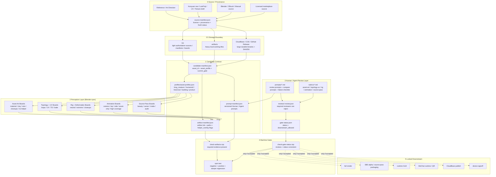
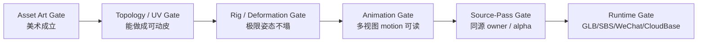

# Blender Harness

Agent 在 Blender 里的作业环境(issue #131),不是"渲染完跑一下"的 QA 工具。它的职责是让 3D 资产从 source 到 runtime 的每个不可逆风险点都有证据、评审和机器阻断。

这版把原来的反馈层地基扩展成通用 3D asset gate contract:同一套 harness 可以保护进贤门长龙、揭小贤、郭之奇、建筑件、产品道具,而不是只服务某条龙。

## 一句话

Blender harness 不负责让作品变好看。它负责让不好看的、来源不清的、拓扑不能动的、UV/材质断裂的、rig 会塌的、动画只会遮丑的、pass 不同源的资产不能继续流到下游。

## 总架构



## 三层定位

| 层 | 是什么 | 当前交付 |
|---|---|---|
| 感知层(agent 的眼) | Blender 固定多视图、近景、wireframe、UV、deformation、motion boards | 通过 `artifact-manifest.json` 形成机器可检查的交付合同;具体 Blender 渲染动词仍会逐步从 `scripts/blender` 收敛 |
| 行动层(agent 的手) | 参数化 Blender 动词,比如 render model/rig/animation/source-pass/package | 本 PR 不重写 77 个历史脚本,但定义它们必须交付的标准 artifact ids |
| 反馈层(环境的判定) | status/review/artifact 聚合判定 + regression | `check-gate-status.mjs`, `check-artifacts.mjs`, schemas, profiles, rubrics, fixtures, templates |

## 目录结构

```text
tools/blender-harness/
  README.md
  package.json
  examples/
    complex-creature-long-dragon.md
    humanoid-ip-jie-xiaoxian.md
  profiles/
    asset-profiles.json
  prompts/
    asset-art-review-v01.md
    topology-uv-review-v01.md
    rig-deformation-review-v01.md
    animation-review-v01.md
    source-pass-review-v01.md
    reference-compare-review-v01.md
    failure-case-checklist-v01.md
  rubrics/
    asset-art-rubric-v01.md
    topology-uv-rubric-v01.md
    rig-deformation-rubric-v01.md
    animation-rubric-v01.md
    source-pass-rubric-v01.md
  schemas/
    gate-status.schema.json
    review.schema.json
    candidate-manifest.schema.json
    artifact-manifest.schema.json
    prompt-manifest.schema.json
    asset-profiles.schema.json
  src/
    check-gate-status.mjs
    check-artifacts.mjs
    run-regression.mjs
  fixtures/
    gate-d-v01-negative/
    synthetic-accepted-control/
    asset-contract-long-creature-accepted/
    asset-art-head-neck-negative/
    asset-contract-humanoid-accepted/
  templates/
    candidate/
    reviews/
    source-asset/
      PROVENANCE.md
      source-manifest.json
    issue-comment.md
```

## Asset Storage Boundary

Blender Harness depends on the project asset layout in `docs/ASSET_LAYOUT.md` and the AR asset manifest in `docs/reference/ar-assets/manifest.json`. A candidate is not allowed to blur source storage, production scratch, durable archive, and runtime delivery.

Use this split:

| Storage | Owns | Commit to Git? | Required record |
|---|---|---:|---|
| `_assets-src/<asset-id>/` | light authoritative source sheets, briefs, ownership matrices, small reference boards, `PROVENANCE.md` | Yes, if each file is small and legally clear | `PROVENANCE.md`, `source-manifest.json`, manifest entry before downstream use |
| `docs/research/.../<candidate>/` | lightweight gate evidence: boards, audits, review JSON, issue-ready summaries | Yes | candidate id, gate id, review verdict, links back to `.artifacts` or durable archive |
| `.artifacts/blender-harness/<candidate-id>/` | full Blender candidate directories, generated boards, local `.blend`, frame sequences, raw working outputs | No | candidate manifests inside the directory; copy only reduced evidence to Git when a gate closes |
| `.artifacts/hunyuan/<asset-id>/<run-id>/` | Hunyuan raw outputs and postprocess runs | No | Hunyuan run manifest, prompt/input hashes, SHA256 of raw GLB/OBJ |
| CloudBase Storage / Tencent COS | large binaries needed by runtime or long-lived source archive | No, store URL/hash only | URL, SHA256, size, provenance, runtime target |
| GitHub Release | milestone source packs or review packs that are too large for Git but should remain tied to repo history | No, store release URL/hash only | release tag, asset URL, SHA256, contents manifest |
| `wechat-*/miniprogram/**/assets/` | runtime assets small enough for the mini program package | Yes, only after package-size decision | manifest entry, runtimeTarget, package-size evidence |

Rules:

- Git stores authority, not every byte: briefs, neutral turnarounds, source manifests, ownership matrices, small boards, gate review JSON, and provenance.
- `.artifacts` stores heavy work in progress: raw GLB/OBJ, `.blend`, high sculpt, texture bakes, frames, videos, failed candidates, and full candidate directories.
- Large files that must survive beyond the local machine go to CloudBase/COS or GitHub Release with SHA256. A local-only path is acceptable only as temporary working state, never as the only durable record.
- Do not enable Git LFS as a silent default. LFS is a separate repo-level decision for versioning large binaries; without an explicit policy, use `.artifacts` plus external archive and Git manifests.
- A source asset without `PROVENANCE.md` and a manifest path is not production source, even if the file exists locally.
- A runtime asset in a mini program package is not a source archive. Keep compressed runtime files separate from source sheets, raw models, and Blender candidates.

## Asset Profiles

`profiles/asset-profiles.json` 是跨资产复用的核心。它定义每类资产每个 gate 必须交什么证据。

| Profile | 用于 | 重点保护 |
|---|---|---|
| `long_creature` | 龙、蛇形长身体角色 | 头颈身体连续、鳞片/腹鳞/背鳍流向、尾根、S 曲线/盘绕/扑镜变形 |
| `humanoid_character` | 揭小贤等 IP/吉祥物 | 脸、比例、服装、配饰、手、表情、retarget 后性格不丢 |
| `historical_figure` | 郭之奇等历史人物 | 服饰年代、气质/年龄/尊严、袍袖变形、手势文化语气 |
| `building_prop` | 楼、台基、栏杆、门框 | 结构咬合、硬边/法线、尺度/锚点、pass owner 可分 |
| `product_prop` | 磁贴、茶具、食物、道具 | 产品边缘、材质完成度、贴近镜头质感、与 marker 尺度一致 |

## Example Assets

Examples are not production acceptance claims. They are reusable stress cases that explain how a profile should be applied to a difficult asset.

| Example | Profile | Why it exists |
|---|---|---|
| `examples/complex-creature-long-dragon.md` | `long_creature` | A complex organic creature case for head-neck-body continuity, source-first routing, retopo/UV/rig/animation gates, and near-lens deformation risk |
| `examples/humanoid-ip-jie-xiaoxian.md` | `humanoid_character` | An unverified IP character example for concept-to-3D generation, face/proportion gates, clothing/accessory binding, and biped/gesture rigging |

## Gate Sequence



### Gate A: Asset Art

先证明资产值得继续。需要 material/clay/wire/silhouette/no-helper/closeup boards。龙必须额外交 head-neck、belly/dorsal、tail-root、scale-flow closeups。揭小贤必须交 face/outfit/body/accessory closeups。郭之奇必须交 face dignity / historical costume / robe sleeve / cultural tone boards。

硬拒包括:只远景成立、helper 遮丑、头颈身体接缝、generic NPC、建筑悬浮、产品边缘脏。

### Gate B: Topology / UV

证明高模/source 已经变成能动画的 mesh。需要 wireframe、edge loops、UV layout、texel density、bake check。自动 retopo / Hunyuan LowPoly 只能是 draft,不能直接 final。

### Gate C: Rig / Deformation

证明 rig 在真实产品姿态下不塌。龙看 S 曲线、tight coil、绕柱、扑镜、head turn/jaw、tail whip、claw spread。人形看表情、手、袖子、配饰、retarget neutral。

### Gate D: Animation

证明 motion 不是路径平移或镜头遮丑。必须有 camera/top/side/asset-only/high-coverage frames。motion 必须视频或密集帧条直读,静帧不算。

### Gate E: Source-Pass

证明 beauty/pass/matte 同源。SAM2、背景移除、视频生成 object pass 只能 guide,不能 final slot。P40R 式 alpha repair 只能在上游资产和动画已 accepted 后使用。

## Manifests

Every candidate must contain:

```text
candidate-manifest.json
artifact-manifest.json
prompt-manifest.json
gate-status.json
source-manifest.json
reviews/<role>-review.json
evidence/*
```

`candidate-manifest.json` declares:

- `candidate_id`
- `asset_id`
- `asset_profile`
- `current_gate`
- source type and license clearance

`artifact-manifest.json` declares artifact ids and paths. Important fields:

- `helper_overlay: true|false` tells the checker whether a board is clean enough for no-helper gates.
- `usable: false` blocks the artifact even if the file exists.

`prompt-manifest.json` declares which versioned Human / Agent review prompts are available to this candidate. `check-artifacts` checks that profile-required prompts exist under `tools/blender-harness/prompts/` before the evidence contract can complete. If `prompt-manifest.json` exists, `check-gate-status` also requires each review to cite a known `prompt_id`; this prevents "prompt library exists, but the review was freehand" drift.

`source-manifest.json` declares source type, license/provenance, storage policy, heavy binary archive pointers, Hunyuan runs, and Blender candidates. Use `templates/source-asset/PROVENANCE.md` plus `templates/source-asset/source-manifest.json` when starting a new source package under `_assets-src/<asset-id>/`. The source package should record every heavy local file by URL/path/SHA256, but should not commit those heavy binaries by default.

## Prompt Library

`prompts/*.md` is the versioned input layer for Human / Agent review. Rubrics define scoring and hard-reject policy; prompts define how the reviewer should use boards, references, failure cases, and output JSON.

| Prompt | Used for |
|---|---|
| `asset-art-review-v01.md` | Asset art gate review before topology/rig/animation work |
| `topology-uv-review-v01.md` | Topology, UV, texel density, and bake review |
| `rig-deformation-review-v01.md` | Rig hierarchy, skin weights, and extreme pose review |
| `animation-review-v01.md` | Motion, staging, camera, and high-coverage frame review |
| `source-pass-review-v01.md` | Beauty/pass/matte owner and runtime boundary review |
| `reference-compare-review-v01.md` | Reference-vs-candidate evidence comparison |
| `failure-case-checklist-v01.md` | Shared hard-reject checklist before any accept verdict |

This is intentionally separate from `reviews/*.json`. A review is the signed output. A prompt is the reproducible instruction set that produced it.

## Commands

```bash
cd tools/blender-harness
npm test
npm run check-gate-status -- <candidate-dir> --json
npm run check-artifacts -- <candidate-dir> --json
```

Exit codes:

| Code | Meaning |
|---|---|
| 0 | Accepted/complete for the checker being run |
| 1 | Rejected/blocked: evidence or reviews did not pass |
| 2 | Contract violation: malformed/missing inputs or inconsistent status |

`check-artifacts` does not judge beauty. It only proves required evidence exists and clean/no-helper constraints are honored. `check-gate-status` does not judge beauty either. It proves required review records exist, required reviewers accepted, downstream status is consistent, and prompt-bound candidates have reviews that cite a declared prompt. Visual authority lives in `reviews/*.json`.

## Regression Fixtures

`npm test` currently asserts 12 paths:

1. Gate-D golden negative remains rejected.
2. Synthetic accepted gate-status control accepts.
3. Missing required review rejects.
4. Rejected status with `downstream_allowed=true` is contract violation.
5. Long-creature asset-art contract accepted fixture completes.
6. Head-neck helper-overlay negative fixture blocks.
7. Humanoid asset-art contract accepted fixture completes.
8. Artifact manifest candidate mismatch is contract violation.
9. Missing required prompt blocks artifact completion.
10. Prompt path escaping `tools/blender-harness` is a contract violation.
11. `prompt-manifest.json` present but review missing `prompt_id` is a contract violation.
12. `prompt-manifest.json` present and review citing a known `prompt_id` remains accepted.

The `asset-art-head-neck-negative` fixture exists specifically because the dragon line leaked a visible head-neck-body seam downstream. Future checker changes must not let that failure mode pass as complete evidence.

## Review Roles

Human reviewers or agent reviewers should be assigned by gate. In this side conversation no subagents were run; this package only defines their contracts.

| Gate | Required review roles from profile/common gate |
|---|---|
| Asset Art | `asset_art_reviewer`, `fresh_visual_reviewer` |
| Topology / UV | `topology_reviewer`, `uv_material_reviewer` |
| Rig / Deformation | `rig_reviewer`, `deformation_reviewer`, `fresh_visual_reviewer` |
| Animation | `animation_reviewer`, `fresh_visual_reviewer` |
| Source-Pass | `source_pass_reviewer`, `runtime_boundary_reviewer`, `fresh_visual_reviewer` |

Reviewer rule: if a board exposes a hard reject, reject. Do not write "accepted but polish later" for a core seam, topology, deformation, or cultural-tone failure.

## How This Applies To Current Assets

### Complex Creature Example: Long Dragon

Use `asset_profile=long_creature`. The long dragon is the harness's complex biological asset example and regression canary, not an accepted production asset in this PR. The first new valid dragon candidate must pass `asset_art` before any retopo/rig/animation/pass work. Required dragon-specific boards include head-neck closeup, belly/dorsal closeup, tail-root closeup, and scale-flow callout. The previous P10E-style failure is now represented by `fixtures/asset-art-head-neck-negative`.

### Jie Xiaoxian

Use `asset_profile=humanoid_character`. Hunyuan mesh/rig output can be source evidence, but asset-art must show face, outfit, body proportion, and accessories. Auto-rig or text-to-motion does not bypass the rig/deformation gate. The unverified example route is documented in `examples/humanoid-ip-jie-xiaoxian.md`.

### Guo Zhiqi

Use `asset_profile=historical_figure`. The asset-art gate must protect historical costume, dignity, face/age, and robe/sleeve material before rigging. Gesture animation must pass cultural-tone review, not only mechanical motion review.

### Building / Product Props

Use `building_prop` or `product_prop`. These profiles protect hard-edge normals, structure joins, pivots, marker scale, product finish, and pass-owner separability.

## Non-Goals Of This PR

- It does not replace all existing `scripts/blender/jxm_dragon_*.py` scripts.
- It does not implement Blender rendering commands yet.
- It does not claim any visual asset is accepted.
- It does not run subagent review.

It does create the contract those scripts and reviewers must satisfy before downstream gates can unlock.
